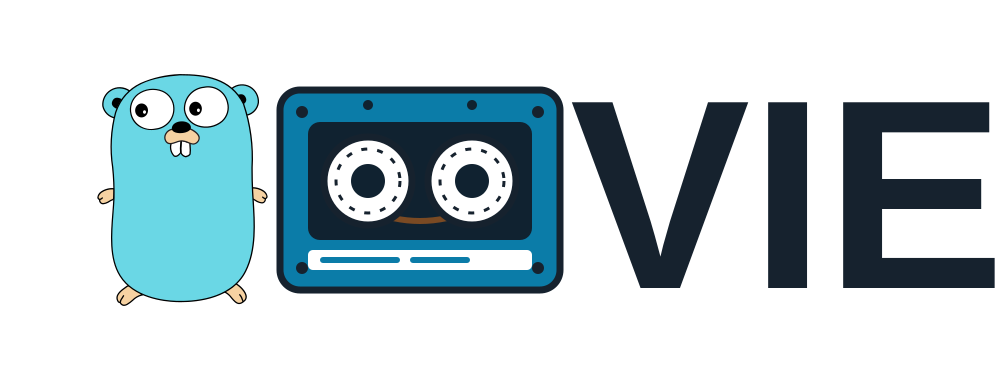

<p align="center">
  
</p>

# Goovie

Goovie is a cross-platform CLI tool built in Go that lets you search and stream movies, shows, and anime directly from your terminal. It bridges your local Prowlarr instance with `webtorrent` and `mpv` to deliver seamless, instant streaming without waiting for downloads to finish.

## Prerequisites

Before running Goovie, ensure you have the following installed on your system:

1. **Prowlarr**: An indexer proxy. Goovie uses this to search across your configured indexers.
2. **WebTorrent CLI**: Used to stream torrents sequentially.
   - Install via Node.js: `npm install -g webtorrent-cli`
3. **MPV Media Player**: The video player used for streaming.
   - **Debian/Ubuntu:** `sudo apt install mpv`
   - **Arch Linux:** `sudo pacman -S mpv`
   - **macOS:** `brew install mpv`
   - **Windows:** `scoop install mpv` or download from [mpv.io](https://mpv.io)

## Installation

### Option 1: Download Pre-compiled Binaries
You can find pre-compiled binaries on the [GitHub Releases](https://github.com/G00VIE/Goovie/releases) page.
- Windows: `goovie-windows-amd64.exe`
- Linux: `goovie-linux-amd64`
- macOS (Intel): `goovie-darwin-amd64`
- macOS (Apple Silicon): `goovie-darwin-arm64`

**Note for Linux/macOS users:** After downloading, you will need to make the binary executable before you can run it:
```bash
chmod +x goovie-*
```

### Option 2: Build from Source
If you have Go installed (1.20+), you can easily build it yourself:
```bash
git clone https://github.com/G00VIE/goovie.git
cd goovie
go build -o goovie ./cmd/goovie/
```

## Configuration & Usage

Goovie requires access to your Prowlarr instance. You must provide your API key via environment variables.

### Linux / macOS
```bash
export PROWLARR_URL="http://127.0.0.1:9696"
export PROWLARR_API_KEY="your_api_key_here"

./goovie
```
*(Tip: Add these environment variables to your `~/.bashrc` or `~/.zshrc` so you don't have to type them every time.)*

### Windows (PowerShell)
```powershell
$env:PROWLARR_URL="http://127.0.0.1:9696"
$env:PROWLARR_API_KEY="your_api_key_here"

.\goovie.exe
```
*(Tip: Add these to your Windows Environment Variables settings to persist them.)*

## How it works (The Workflow)
1. **Search**: Enter the name of the movie or show into the beautiful terminal UI.
2. **Scrape**: Goovie concurrently queries all your active Prowlarr indexers using the API.
3. **Select**: Goovie aggregates the results and presents a clean list sorted by the number of seeders.
4. **Resolve**: Once you pick a torrent, Goovie resolves the proxy link into a raw `magnet:` URI or a `.torrent` file payload.
5. **Watch**: WebTorrent immediately buffers the media sequentially and pipes it directly into the MPV player.

## Architecture Details
For a deeper dive into the codebase and project structure, see [ARCHITECTURE.md](ARCHITECTURE.md).

## Credits
Goovie was built with and inspired by the following incredible open-source projects:

- [ani-cli](https://github.com/pystardust/ani-cli) - The original inspiration that sparked the idea to build this tool.
- [bubble-stream](https://github.com/talnz/bubble-stream) - The original proof of concept and TUI core this project evolved from.
- [Bubble Tea](https://github.com/charmbracelet/bubbletea) - The powerful, elegant TUI framework used to build the interface.
- [WebTorrent](https://github.com/webtorrent/webtorrent-cli) - The streaming torrent client that makes instant playback possible.
- [MPV](https://github.com/mpv-player/mpv) - The robust command-line video player used for rendering the media.
- [Prowlarr](https://github.com/Prowlarr/Prowlarr) - The supreme indexer manager/proxy.
