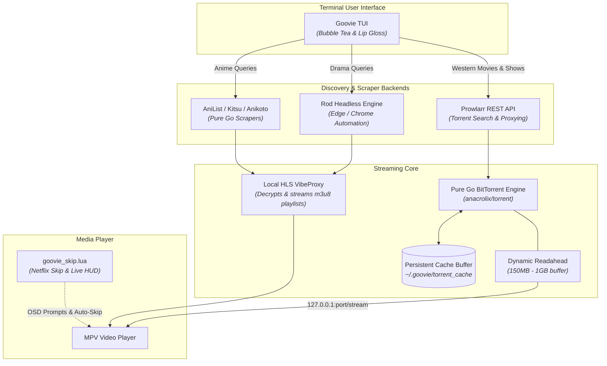
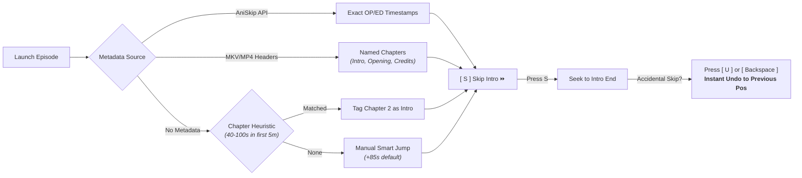

<p align="center">
  
</p>

# Goovie

> *"Because why wait 45 minutes for a torrent to download when you can just stream it immediately in terminal glory?"*

**Goovie** is an ultra-fast, aesthetic terminal streaming suite written in 100% pure **Go**. Whether you want to channel your inner **Deadpool** for blockbuster movies, cook up some prestige television with **Heisenberg**, curse-spirit binge anime with **Itadori**, or cry your eyes out to your favorite **K-Drama**, Goovie hooks directly into your terminal and pipes live media into `mpv`.

Zero Node.js. Zero WebTorrent CLI bloat. Pure compiled Go power.

---

## Features That Slap

- **Pure Go BitTorrent Engine**: Built-in sequential torrent streaming powered by `anacrolix/torrent`. Starts playback within seconds using sequential piece prioritization, aggressive peer unchoking, and multi-tracker announcements.
- **Universal Netflix-Style Skip Intro / Outro**: On-screen prompts (`[S] Skip Intro`) or automated skipping powered by multi-tier intelligence: AniSkip API timestamps, MKV/MP4 embedded chapters, unnamed chapter heuristics, and an +85s smart jump fallback with instant undo (`[U]` / `[Backspace]`). Zero crashes, even on un-tagged files.
- **Configurable Download Cache Buffer**: Choose your buffer cushion in settings: 150 MB (~9 min), 256 MB (~16 min default), 512 MB (~32 min), or 1024 MB (full episode buffer). BitTorrent readahead and MPV demuxer cache are fully synchronized.
- **Slow-Connection Anti-Stutter Suite**: Designed for unreliable or low-bandwidth networks. MPV automatically pauses on buffer underruns with a 15-second recharge window (`--cache-pause-wait=15`) and displays a live buffering HUD instead of audio-glitching micro-freezes.
- **Persistent Torrent Cache across Reboots**: Accidental terminal close or sudden laptop shutdown? Downloaded chunks are safely preserved in `~/.goovie/torrent_cache/`. Re-opening the episode resumes instantly without re-downloading. Progressive LRU pruning automatically manages a 10 GB disk quota, and cache can be cleared on demand (`[x]`).
- **Continue Watching (Pick Up Where You Left Off)**: Tracks playback timestamps in real-time (every 5 seconds, upon pause, and on shutdown). The home screen prominently displays your active session with a 1-key instant resume shortcut (`[c]`) straight to the exact second.
- **Watch History & Binge Progression**: Displays watched checkmarks (`[✓]`) in episode navigation and automatically advances the selection cursor to the next episode upon completion.
- **Startup Health Check & Autonomous Setup**: Fresh PC? No problem. Goovie checks your setup on boot. Press `[ 1 ]` to auto-install MPV, Prowlarr, bypass browser login wizards, and auto-inject top indexers automatically.
- **Zero-Setup Anime**: Powered by pure Go scrapers (AniList, Kitsu, and Anikoto). Works right out of the box with zero external indexers or torrent clients needed.
- **Asian Drama & K-Drama Streaming**: Embedded headless Rod engine (runs right on your built-in Edge or Chrome) to scrape and stream drama episodes seamlessly.
- **Zero Open Ports & Clean Shutdown**: When you exit or finish an episode, all streaming servers shut down tight, listeners are closed, and temporary scratch data is cleared cleanly.
- **Aesthetic Bubble Tea TUI**: Retro ASCII banners, live spinners, dynamic camera navigation, and custom art for every genre.

---

## System Requirements

| Media Category | Backend Engine | Requirements | Status |
| :--- | :--- | :--- | :--- |
| **Anime** | Pure Go + Anikoto + AniList | `mpv` | Ready out of the box |
| **K-Drama / Asian Media** | Rod Headless Browser | `mpv` + Edge / Chrome | Ready on Windows (Edge pre-installed) |
| **Western Movies & Shows** | Prowlarr + Pure Go BitTorrent | `mpv` + Prowlarr | Press `[ 1 ]` in setup to auto-install |

> [!NOTE]
> Prowlarr is required to index Western movies and TV shows. Anime and Asian drama streams work instantly without Prowlarr. If you want full access to Hollywood movies and TV shows, simply tap `[ 1 ]` on the setup screen to let Goovie handle the heavy lifting.

---

## Quickstart (Windows)

1. Grab the latest `goovie.exe` from [Releases](https://github.com/G00VIE/Goovie/releases).
2. Double-click or run in your favorite terminal (`wt`, PowerShell, Command Prompt):
   ```powershell
   .\goovie.exe
   ```
3. If it is your first run, the **Goovie System Setup & Health** dashboard will appear:
   ```text
   ═══════════════════ GOOVIE SYSTEM SETUP & HEALTH ═══════════════════

     [✓ INSTALLED]  MPV Video Player
     [✗ NOT FOUND]  Prowlarr Torrent Indexer
         ↳ Western Media is a NO GO (Movies & TV shows disabled)
     [✓ INSTALLED]  Browser Engine (Rod / Edge / Chrome for K-Drama)
     [✓ BUILT-IN ]  Pure Go Anime Scraper (AniList / Kitsu / Anikoto)

   ─────────────────────────────────────────────────────────────────────
     Current Limitations:
     • Western Media is a NO GO (Prowlarr missing)
   ─────────────────────────────────────────────────────────────────────

     [ 1 ] Auto-install everything (MPV + Prowlarr + Top Indexers)
     [ 2 ] Continue to Goovie (Watch Anime + K-Drama)
     [ q ] Quit
   ```
4. Press **`1`**:
   - Downloads and installs `mpv` and `Prowlarr` via Windows Package Manager (`winget`).
   - Pre-seeds Prowlarr configuration (`<AuthenticationMethod>None</AuthenticationMethod>`) so you never have to deal with browser login wizards.
   - Auto-injects top public indexers (YTS, The Pirate Bay, LimeTorrents, EZTV, TorrentGalaxy).
   - Done! You are ready to stream anything in existence.

---

## Controls and Keybindings

### Terminal UI Controls

| Keybinding | Action |
| :--- | :--- |
| `←` / `→` | Switch categories (Movies, TV Shows, Anime) |
| `↑` / `↓` | Navigate list items and search results |
| `[Enter]` | Confirm selection / Play stream |
| `[c]` / `[C]` | **Resume Playback / Continue Watching** (Home screen & Mode Select) • Cycle download cache buffer (in Setup & Health) |
| `[s]` | Open **System Setup & Health** dashboard anytime from menus |
| `[k]` / `[K]` | Toggle **Skip Intro Mode** (`Netflix Prompt` ➔ `Auto-Skip` ➔ `Off`) in Setup & Health |
| `[r]` / `[R]` | Toggle **Auto-Resume** in Setup & Health |
| `[x]` / `[X]` | **Clear Persistent Torrent Cache** in Setup & Health |
| `0` - `9` | Instant episode jump (type `12` in season menu to jump directly to Episode 12) |
| `[Backspace]` | Go back to previous screen |
| `[Esc]` / `[q]` | Exit cleanly (closes active ports and listeners) |

### In-Player (MPV) Video Controls

| Keybinding | Action |
| :--- | :--- |
| `[S]` / `[s]` | **Skip Intro / Outro** (or trigger smart +85s jump if metadata is absent) |
| `[U]` / `[Backspace]` | **Instant Undo** (reverts jump back to exact previous timestamp) |
| `[I]` / `[i]` | Toggle **Live Stream Info & Cache HUD** (buffered megabytes, readahead time, positions) |
| `[Space]` | Pause / Resume playback (triggers live buffering overlay during cache underruns) |
| `[q]` | Quit player (automatically saves exact watch timestamp for instant continuation) |

---

## Architecture and Data Flow


```mermaid
flowchart TD
    subgraph UI ["Terminal User Interface"]
        CLI["Goovie TUI<br/><i>(Bubble Tea & Lip Gloss)</i>"]
    end

    subgraph Scrapers ["Discovery & Scraper Backends"]
        Anime["AniList / Kitsu / Anikoto<br/><i>(Pure Go Scrapers)</i>"]
        Drama["Rod Headless Engine<br/><i>(Edge / Chrome Automation)</i>"]
        Western["Prowlarr REST API<br/><i>(Torrent Search & Proxying)</i>"]
    end

    subgraph Core ["Streaming Core"]
        Proxy["Local HLS VibeProxy<br/><i>(Decrypts & streams m3u8 playlists)</i>"]
        Engine["Pure Go BitTorrent Engine<br/><i>(anacrolix/torrent)</i>"]
        DiskCache[("Persistent Cache Buffer<br/><i>~/.goovie/torrent_cache</i>")]
        Readahead["Dynamic Readahead<br/><i>(150MB - 1GB buffer)</i>"]
    end

    subgraph Playback ["Media Player"]
        MPV["MPV Video Player"]
        Lua["goovie_skip.lua<br/><i>(Netflix Skip & Live HUD)</i>"]
    end

    CLI -->|Anime Queries| Anime
    CLI -->|Drama Queries| Drama
    CLI -->|Western Movies & Shows| Western

    Anime --> Proxy
    Drama --> Proxy
    Western --> Engine

    Engine <--> DiskCache
    Engine --- Readahead
    Proxy --> MPV
    Readahead -->|127.0.0.1:port/stream| MPV
    Lua -.->|OSD Prompts & Auto-Skip| MPV
```


```mermaid
flowchart LR
    Start["Launch Episode"] --> Check{"Metadata Source"}
    Check -->|"AniSkip API"| AniSkip["Exact OP/ED Timestamps"]
    Check -->|"MKV/MP4 Headers"| Chapters["Named Chapters<br/><i>(Intro, Opening, Credits)</i>"]
    Check -->|"No Metadata"| Heuristics{"Chapter Heuristic<br/><i>(40-100s in first 5m)</i>"}

    Heuristics -->|Matched| AutoTag["Tag Chapter 2 as Intro"]
    Heuristics -->|None| Fallback["Manual Smart Jump<br/><i>(+85s default)</i>"]

    AniSkip --> Prompt["[ S ] Skip Intro ⏩"]
    Chapters --> Prompt
    AutoTag --> Prompt
    Fallback --> Prompt

    Prompt -->|Press S| Skip["Seek to Intro End"]
    Skip -->|Accidental Skip?| Undo["Press [ U ] or [ Backspace ]<br/><b>Instant Undo to Previous Pos</b>"]
```

1. **Resolution & Search**: Queries Cinemeta, TVMaze, and AniList for metadata, then dispatches concurrent searches across Prowlarr or direct scrapers.
2. **Sequential Piece Prioritization**: Pieces are prioritized sequentially to allow immediate streaming without waiting for full torrent downloads.
3. **Local HTTP Range Server**: Streams content directly into MPV over `127.0.0.1:0` with HTTP byte-range support for seeking.
4. **Cache & Resource Management**: Downloaded chunks are preserved in persistent cache (`~/.goovie/torrent_cache/`) for instant re-watching or continuation, while network sockets and ephemeral streams are cleanly closed.

---

## Manual Installation

### 1. Video Player (`mpv`)
- **Windows**: `winget install shinchiro.mpv` or `choco install mpv`
- **macOS**: `brew install mpv`
- **Linux**: `sudo apt install mpv` or `sudo pacman -S mpv`

### 2. Torrent Indexer (`Prowlarr`)
- **Windows**: Run `winget install TeamProwlarr.Prowlarr`, or use the built-in installer (`[ 1 ]`).
- **macOS**: `brew install --cask prowlarr`
- **Docker**:
  ```bash
  docker run -d \
    --name=prowlarr \
    -p 9696:9696 \
    -v /path/to/data:/config \
    --restart unless-stopped \
    lscr.io/linuxserver/prowlarr:latest
  ```

### 3. FlareSolverr (Optional Cloudflare Bypass)
If indexers require Cloudflare challenge resolution:
```bash
docker run -d \
  --name=flaresolverr \
  -p 8191:8191 \
  -e LOG_LEVEL=info \
  --restart unless-stopped \
  ghcr.io/flaresolverr/flaresolverr:latest
```

---

## Building from Source

Prerequisites: [Go 1.22+](https://golang.org/dl/)

```bash
# Clone the repository
git clone https://github.com/G00VIE/Goovie.git
cd Goovie

# Build executable
go build -o goovie ./cmd/goovie

# Run
./goovie
```

---

## Acknowledgements

- [ani-cli](https://github.com/pystardust/ani-cli) - Terminal streaming inspiration.
- [Bubble Tea](https://github.com/charmbracelet/bubbletea) & [Lip Gloss](https://github.com/charmbracelet/lipgloss) - Beautiful, expressive terminal aesthetics.
- [anacrolix/torrent](https://github.com/anacrolix/torrent) - Full-featured pure Go BitTorrent client implementation.
- [go-rod/rod](https://github.com/go-rod/rod) - DevTools-driven browser automation for zero-hassle drama scraping.
- [MPV](https://mpv.io/) - Media player engine.
- [Prowlarr](https://prowlarr.com/) - Indexer aggregation proxy.

---

<p align="center">
  <i>Crafted with Go. Grab your popcorn and enjoy the show!</i>
</p>

